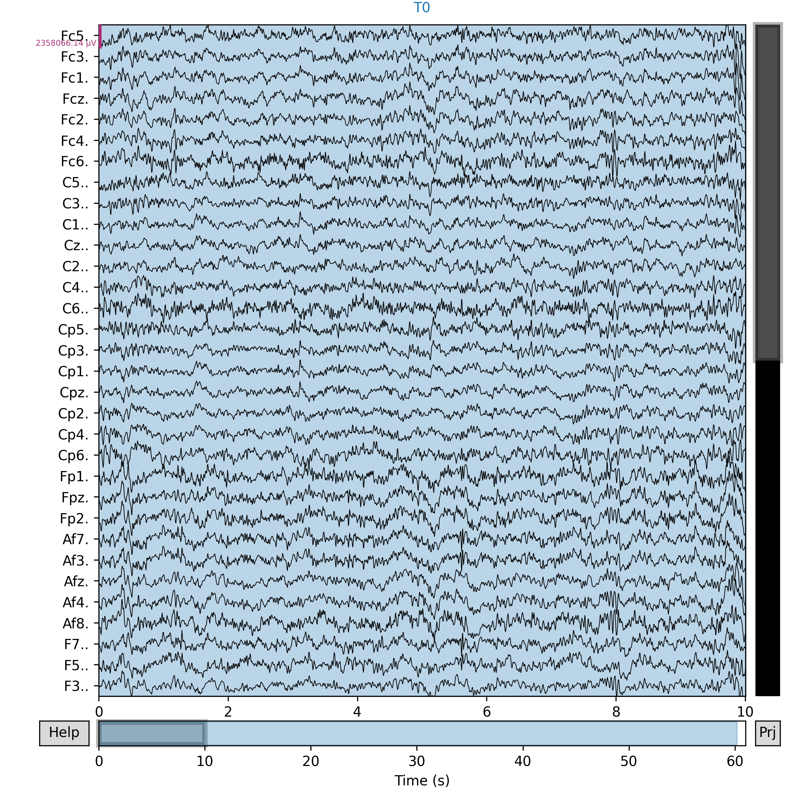
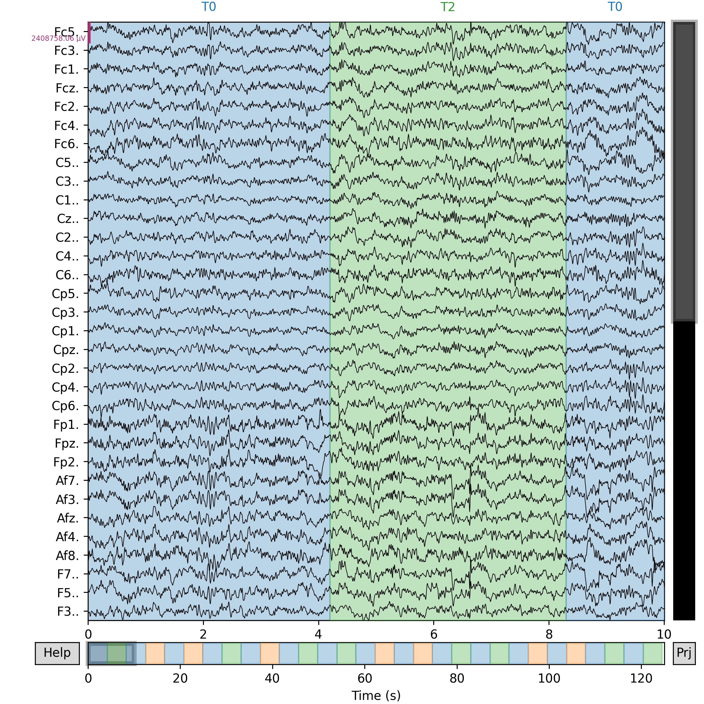

# Laboratorio de actividad de procesamiento y análisis de señales EEG

## Contenidos
1. [Origen de los Datos](#1-origen-de-los-datos)
2. [Preprocesamiento](#2-preprocesamiento)
3. [Extracción de Características](#3-extracción-de-características)
4. [Optimización y Selección de Features](#4-optimización-y-selección-de-features)
5. [Discusión](#6-discusion)
6. [Referencias](#7-referencias)

## 1. Origen de los Datos

**Fuente [1]:** [EEG Motor Movement/Imagery Dataset (EEGBCI)](https://physionet.org/content/eegmmidb/1.0.0/)

Esta base de datos está compuesta por 109 sujetos. Para cada caso, se realizaron las siguientes sesiones:

1. Basal: ojos abiertos
2. Basal: ojos cerrados
3. Tarea 1: abrir y cerrar el puño derecho o izquierdo
4. Tarea 2: imaginar que se abre y cierra el puño derecho o izquierdo
5. Tarea 3: abrir y cerrar ambos puños o ambos pies 
6. Tarea 4: imaginar que se abren y cierran ambos puños o ambos pies
7. Se volvieron a repetir las tareas 1-4.
  
Se utilizaron 64 electrodos con un sistema de distribución 10-10 y los datos se encuentran en formato `.edf´

## 2. Preprocesamiento
**Objetivo:** limpiar las señales de EEG mediante técnicas de filtrado (por ejemplo, filtros pasa banda, notch y wavelet), eliminar artefactos (blink, EMG, ECG) y normalizar/alinear las señales para hacerlas comparables entre sesiones y sujetos.

Para el laboratorio nos basaremos en la data del primer y segundo sujeto analizando solo la data de las primeras 6 actividades (que se indicaron previamente). Es decir, de la base de datos, utilizaremos los siguientes archivos: 
* Primer sujeto: `S001R01.edf  S001R02.edf  S001R03.edf  S001R04.edf  S001R05.edf  S001R06.edf  S001R07.edf`
* Segundo sujeto: `S002R01.edf  S002R02.edf  S002R03.edf  S002R04.edf  S002R05.edf  S002R06.edf  S002R07.edf`  

**Pasos a seguir:**
1. Carga de datos: Se cargaron los datos `.edf` utilizando la función `mne.io.read_raw_edf()`. Los datos del archivo se almacenaron en `raw`
2. Visualización de la señal cruda (`raw`): se utiliza la herramienta `raw.plot()` visualizamos los primeros 10 segundos y utilizamos `scalings='auto'` para evitar que los canales se superpongan al visualizar el ploteo.
3. Filtración de la señal: se aplicó un filtro pasa-banda con un rango de frecuencias de 1 a 40 Hz. Esto garantiza la eliminación de ruidos de baja y alta frecuencia que se encuentran fuera del rango para la actividad EEG.
4. Filtro Notch: se aplica un filtro Notch a 60 Hz para eliminar la interferencia que haya podido generar la red eléctrica. Es decir, eliminamos ruidos de alta frecuencia.
5. Análisis ICA: este análisis permite identificar y eliminar artefactos como el parpadeo o movimientos musculares que pueden distorsionar la data de interés. Los componentes identificados son excluídos de la señal para luego ser eliminados mediante la corrección ICA. El resultado será una señal limpia.
6. Se aplica una normalización a la señal ya limpia. Esto permitirá comparar con otras de las tareas realizadas o con otro sujeto.
7. Visualización de señal filtrada y normalizada: al igual que en la señal cruda, visualizamos los 10 primeros segundos de la señal, ahora filtrada y usamos `scalings='auto'`para evitar solapamiento de los canales

**Resultados obtenidos**
### Paciente 1:
| Actividad                 | Señal Filtrada                |
|-----------------------|--------------------|
| Basal 1               | |
| Basal 2     ||
| Tarea 1     ||
| Tarea 2 ||
| Tarea 3 ||
| Tarea 4 ||

### Paciente 2:
| Actividad                 | Señal Filtrada                |
|-----------------------|--------------------|
| Basal 1               | |
| Basal 2     ||
| Tarea 1     ||
| Tarea 2 ||
| Tarea 3 ||
| Tarea 4 ||

## 3. Extracción de Características
**Objetivo:** aplicar técnicas de feature engineering sobre las componentes extraídas (estadísticas, bandas, transformaciones) para mejorar la calidad de los datos antes de alimentar modelos de clasificación.
## 4. Optimización y Selección de Features
**Objetivo:** integrar y analizar los datos a través de observaciones temporales, frecuenciales y espaciales empleando MNE Python (Epochs, Evoked, montage, interpolate_bads).

## 5. Discusión

## 6. Referencias
[1] Schalk, G., McFarland, D.J., Hinterberger, T., Birbaumer, N., Wolpaw, J.R. BCI2000: A General-Purpose Brain-Computer Interface (BCI) System. IEEE Transactions on Biomedical Engineering 51(6):1034-1043, 2004.
