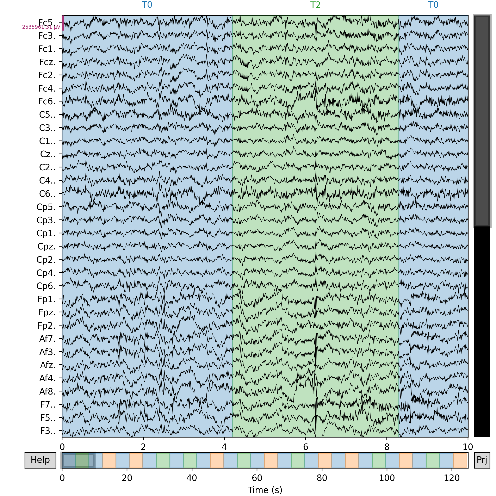
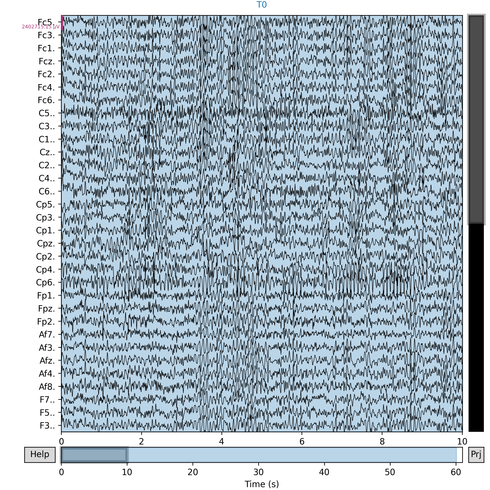

# Laboratorio de actividad de procesamiento y análisis de señales EEG

## Contenidos
1. [Origen de los Datos](#1-origen-de-los-datos)
2. [Preprocesamiento](#2-preprocesamiento)
3. [Extracción de Características](#3-extracción-de-características)
4. [Optimización y Selección de Features](#4-optimización-y-selección-de-features)
5. [Discusión](#6-discusion)
6. [Conclusiones y Recomendaciones]
7. [Referencias](#7-referencias)

## 1. Origen de los Datos

**Fuente [1]:** [EEG Motor Movement/Imagery Dataset (EEGBCI)](https://physionet.org/content/eegmmidb/1.0.0/)

Esta base de datos está compuesta por 109 sujetos. Para cada caso, se realizaron las siguientes sesiones:

1. Basal: ojos abiertos
2. Basal: ojos cerrados
3. Tarea 1: abrir y cerrar el puño derecho o izquierdo
4. Tarea 2: imaginar que se abre y cierra el puño derecho o izquierdo
5. Tarea 3: abrir y cerrar ambos puños o ambos pies 
6. Tarea 4: imaginar que se abren y cierran ambos puños o ambos pies
7. Se volvieron a repetir las tareas 1-4.
  
Se utilizaron 64 electrodos con un sistema de distribución 10-10 y los datos se encuentran en formato `.edf´

## 2. Preprocesamiento
**Objetivo:** limpiar las señales de EEG mediante técnicas de filtrado (por ejemplo, filtros pasa banda, notch y wavelet), eliminar artefactos (blink, EMG, ECG) y normalizar/alinear las señales para hacerlas comparables entre sesiones y sujetos.

Para el laboratorio nos basaremos en la data del primer y segundo sujeto analizando solo la data de las primeras 6 actividades (que se indicaron previamente). Es decir, de la base de datos, utilizaremos los siguientes archivos: 
* Primer sujeto: `S001R01.edf  S001R02.edf  S001R03.edf  S001R04.edf  S001R05.edf  S001R06.edf  S001R07.edf`
* Segundo sujeto: `S002R01.edf  S002R02.edf  S002R03.edf  S002R04.edf  S002R05.edf  S002R06.edf  S002R07.edf`  

**Pasos a seguir:**
1. Carga de datos: Se cargaron los datos `.edf` utilizando la función `mne.io.read_raw_edf()`. Los datos del archivo se almacenaron en `raw`
2. Visualización de la señal cruda (`raw`): se utiliza la herramienta `raw.plot()` visualizamos los primeros 10 segundos y utilizamos `scalings='auto'` para evitar que los canales se superpongan al visualizar el ploteo.
3. Filtración de la señal: se aplicó un filtro pasa-banda con un rango de frecuencias de 1 a 40 Hz. Esto garantiza la eliminación de ruidos de baja y alta frecuencia que se encuentran fuera del rango para la actividad EEG.
4. Filtro Notch: se aplica un filtro Notch a 60 Hz para eliminar la interferencia que haya podido generar la red eléctrica. Es decir, eliminamos ruidos de alta frecuencia.
5. Análisis ICA: este análisis permite identificar y eliminar artefactos como el parpadeo o movimientos musculares que pueden distorsionar la data de interés. Los componentes identificados son excluídos de la señal para luego ser eliminados mediante la corrección ICA. El resultado será una señal limpia.
6. Se aplica una normalización a la señal ya limpia. Esto permitirá comparar con otras de las tareas realizadas o con otro sujeto.
7. Visualización de señal filtrada y normalizada: al igual que en la señal cruda, visualizamos los 10 primeros segundos de la señal, ahora filtrada y usamos `scalings='auto'`para evitar solapamiento de los canales

**Resultados obtenidos**
### Paciente 1:
| Actividad                 | Señal Filtrada                |
|-----------------------|--------------------|
| Basal 1               | |
| Basal 2     ||
| Tarea 1     ||
| Tarea 2 ||
| Tarea 3 ||
| Tarea 4 ||

### Paciente 2:
| Actividad                 | Señal Filtrada                |
|-----------------------|--------------------|
| Basal 1               | |
| Basal 2     ||
| Tarea 1     ||
| Tarea 2 ||
| Tarea 3 ||
| Tarea 4 ||

## 3. Extracción de Características
**Objetivo:** aplicar técnicas de feature engineering sobre las componentes extraídas (estadísticas, bandas, transformaciones) para mejorar la calidad de los datos antes de alimentar modelos de clasificación.
## 4. Optimización y Selección de Features
**Objetivo:** integrar y analizar los datos a través de observaciones temporales, frecuenciales y espaciales empleando MNE Python (Epochs, Evoked, montage, interpolate_bads).

## 5. Resultados PCA

**Resultados obtenidos**

### Paciente 1:
| Actividad                 | PCA Obtenido               |
|-----------------------|--------------------|
| Basal 1               | |
| Basal 2     ||
| Tarea 1     ||
| Tarea 2 ||
| Tarea 3 ||
| Tarea 4 ||

### Paciente 2:
| Actividad                 | PCA Obtenido               |
|-----------------------|--------------------|
| Basal 1               | |
| Basal 2     ||
| Tarea 1     ||
| Tarea 2 ||
| Tarea 3 ||
| Tarea 4 ||

## 6. Discusión

El Análisis de Componentes Principales (PCA) fue aplicado a las características extraídas de las señales EEG correspondientes a distintas tareas motoras (reales e imaginadas) y condiciones basales de dos pacientes. Esta técnica permite reducir la dimensionalidad de los datos para facilitar su visualización, detectar patrones, evaluar la distribución y localizar valores atípicos.

### Paciente 1

- **Basal 1:** La distribución se encuentra mayormente concentrada en torno al origen, con dispersión moderada. Hay algunos puntos alejados (por ejemplo, hacia la derecha y en el eje inferior), lo cual podría deberse a ruido o variabilidad individual en el estado de reposo con ojos abiertos.

- **Basal 2:** La nube de puntos es más compacta y centrada. La mayoría de las muestras se agrupan cercanamente sin outliers extremos. Refleja estabilidad cerebral durante el reposo con ojos cerrados.

- **Tarea 1 (movimiento real de puño):** Aparece una dispersión mayor, con varios puntos separados del grupo principal. Esto podría deberse a la activación neuronal más marcada durante la tarea motora, lo cual introduce más variabilidad en las características EEG.

- **Tarea 2 (imaginación de movimiento):** Aumenta la dispersión vertical, lo que sugiere que los patrones EEG durante la imaginación de movimiento presentan una variabilidad propia, aunque menos pronunciada que la tarea real.

- **Tarea 3 (movimiento de ambos puños/pies):** Se observa una nube bastante densa pero con dos outliers notables. Podrían representar ensayos con una respuesta más intensa o ruidosa.

- **Tarea 4 (imaginación de ambos puños/pies):** La distribución se alarga fuertemente en el eje horizontal (PC1), con un outlier extremo alrededor de 300. Esto indica que, si bien la mayoría de las muestras son similares, existen algunas con diferencias significativas en la representación mental del movimiento.

### Paciente 2

- **Basal 1:** A pesar de que la mayoría de puntos se encuentran agrupados, existen valores atípicos, particularmente uno muy a la izquierda en PC1 ≈ -85. La dispersión sugiere cierta variabilidad individual incluso en estado basal con ojos abiertos.

- **Basal 2:** Distribución más centrada que Basal 1 pero ligeramente desplazada hacia la izquierda. Aunque hay algunos valores atípicos, la nube principal indica un estado más uniforme.

- **Tarea 1 (movimiento real de puño):** Mayor dispersión en el eje horizontal. Aparece un outlier importante (≈ 200 en PC1 y 100 en PC2), lo que sugiere una activación cerebral mucho más intensa o ruido fisiológico.

- **Tarea 2 (imaginación de movimiento):** Nube compacta, centrada, con menos dispersión que en la tarea real. Es consistente con estudios que reportan una menor activación cortical durante tareas motoras imaginadas.

- **Tarea 3 (movimiento de ambos puños/pies):** Aparece una distribución diagonal descendente, con más dispersión que en las tareas previas. Esto indica heterogeneidad en la ejecución de la tarea motora compleja.

- **Tarea 4 (imaginación de ambos puños/pies):** Patrón central con un par de outliers que sobresalen (uno sobre PC1 ≈ 150). Puede deberse a una respuesta mental más intensa o diferencias cognitivas en la imaginación motora.

### Comparación General

- **Condiciones basales** tienden a presentar menor dispersión y valores más agrupados, como era de esperarse en estados de reposo. Aun así, los outliers presentes en algunas sesiones indican que incluso en reposo pueden aparecer variaciones fisiológicas relevantes.

- **Tareas reales (Tarea 1 y 3)** presentan mayor dispersión general en ambos pacientes, lo cual sugiere una activación cortical más compleja y variable.

- **Tareas imaginadas (Tarea 2 y 4)** tienden a tener agrupamientos más claros, aunque en algunos casos aparecen valores muy extremos (por ejemplo, Tarea 4 en ambos pacientes), lo que puede reflejar diferencias individuales en la habilidad de imaginación motora.

- El **Paciente 2** parece tener mayor variabilidad general entre tareas, con patrones más separados y presencia frecuente de outliers, lo cual podría estar asociado a una mayor reactividad cortical o menor homogeneidad en sus respuestas.

### 7. Conclusiones y Recomendaciones

- Las representaciones PCA reflejan con claridad la diferencia entre estados basales, tareas reales e imaginadas. El agrupamiento y dispersión son consistentes con lo que se espera en la literatura sobre EEG y tareas motoras.

- Se deben **analizar y filtrar los outliers extremos**, ya que podrían afectar negativamente a los modelos de clasificación o clustering en etapas posteriores.

- Es recomendable complementar este análisis con técnicas no lineales como **t-SNE** o **UMAP** para capturar patrones que el PCA no detecta completamente.

- Para validación cuantitativa, se sugiere calcular la **varianza explicada por cada componente principal**, asegurando que PC1 y PC2 contengan una proporción significativa de la información total.

- Finalmente, la visualización con etiquetas de clase o color según tarea podría ayudar a identificar agrupamientos específicos, facilitando el análisis de separabilidad entre condiciones cognitivas y motoras.
  
## 8. Referencias
[1] Schalk, G., McFarland, D.J., Hinterberger, T., Birbaumer, N., Wolpaw, J.R. BCI2000: A General-Purpose Brain-Computer Interface (BCI) System. IEEE Transactions on Biomedical Engineering 51(6):1034-1043, 2004.
