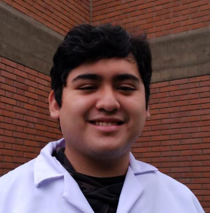

# GRUPO5-ISB-2025-I
| Foto | Presentación | 
|----------|----------|
|    | Hola, me llamo Wendy. Estudiante de Ingeniería Biomédica me interesa aprender más sobre las señales biomédicas y poder aplicar dichos conocimientos en la carrera. Me interesa la ingeniería clínica y la ingeniería de tejidos.   |
|  | Hola, me llamo Rodrigo Chuquiyure, me interesa la ingeniería clínica y sus aplicaciones, por ello espero que el curso me nutra de conocimientos para aplicarlos en el ámbito profesional |
|      | Hola, soy Alejandro Ecos Manrique y estoy interesado en la biomecánica y la rehabilitación y espero aprender sobre la adquisición de señales para poder aplicarlo a la especialidad de mi interés.   |
|  | Hola, soy Aaron y espero poder aprender más sobre señales para descubrir nuevas aplicaciones en mi carrera enfocada a realizar proyectos innovadores en salud | 
|     | ¡Hola! Soy Gabriela Sánchez, estudiante de 7mo ciclo de la carrera de Ingeniería Biomédica, apasionada desde siempre por la tecnología y la biomecánica. Me interesa el procesamiento de señales, el diseño de dispositivos biomédicos y la robótica aplicada a la salud. | 

